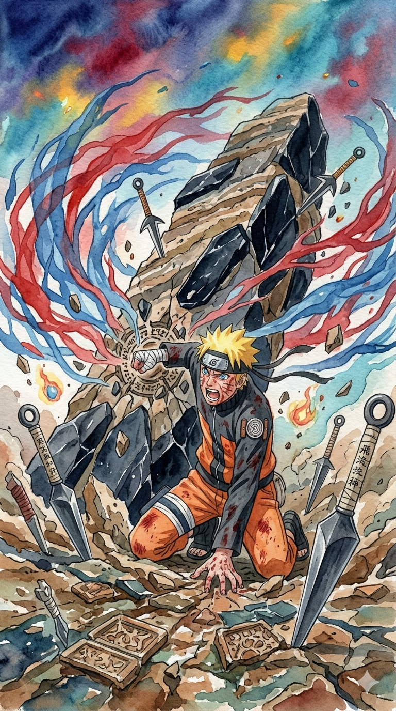

# Ninja-Mayhem
a shinobi browser game

<div align="center" >
  <h2>Characters</h2>
  <table>
    <tr>
      <td align="center" style="width:100%">
        <br/>
        <b>Sakura</b><br/>
        Paladin
      </td>
      <td align="center">
        <br/>
        <b>4th Raikage</b><br/>
        Barbarian
      </td>
      <td align="center">
        <br/>
        <b>Orochimaru</b><br/>
        Mage
      </td>
      <td align="center">
        <br/>
        <b>Naruto</b><br/>
        Rogue
      </td>
    </tr>
  </table>
</div>

---

## Getting Started: Local Installation & Running the Game

Follow these steps to set up and run Ninja-Mayhem on your computer:

### 1. Requirements

- [Node.js](https://nodejs.org/) (version 14 or higher recommended)
- [Git](https://git-scm.com/) (optional, if you want to clone the repository)

### 2. Clone or Download the Repository

You can either clone the repository using Git or download it as a ZIP file.

#### Option A: Clone with Git

```bash
git clone https://github.com/JupiShy/Ninja-Mayhem.git
cd Ninja-Mayhem
```

#### Option B: Download ZIP

1. Go to [https://github.com/JupiShy/Ninja-Mayhem](https://github.com/JupiShy/Ninja-Mayhem)
2. Click "**Code**" > "**Download ZIP**"
3. Unzip, then open the folder in your terminal

### 3. Install Dependencies

Run the following command in the project directory:

```bash
npm install
```

### 4. Start the Local Server

Use the following command to start the game server:

```bash
npm start
```
or if specified:
```bash
node server.js
```

### 5. Play the Game

Open your web browser and go to:

```
http://localhost:3000
```
(or the port displayed in your terminal)

---

**Troubleshooting:**
- If you have an error about missing `npm`, make sure Node.js is installed.
- If the port is busy, check you don’t have another instance running.

Enjoy playing Ninja-Mayhem locally!

---

***Disclaimer: This is a non-profit, fan-made project created for entertainment and educational purposes only. This game is not affiliated with, endorsed by, or sponsored by Shueisha, Studio Pierrot, or Bandai Namco Entertainment. All characters, names, and related imagery are trademarks and copyright of their respective owners. Support the official releases. No copyright infringement is intended.***
